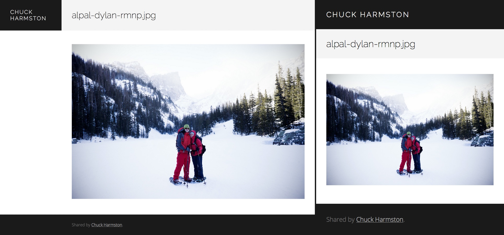

# dropshare-chuck

Custom landing page for [Dropshare](http://getdropsha.re/).

## Usage

Paste the content of [index.html](index.html) into the appropriate place in the "Landing Page" section of the Dropshare preferences.

## Preview

## TODO:

- [x] HTML5 video player for video files.
- [x] Basic CSS for Markdown -> HTML files.
- [ ] HTML5 audio player for audio files.
